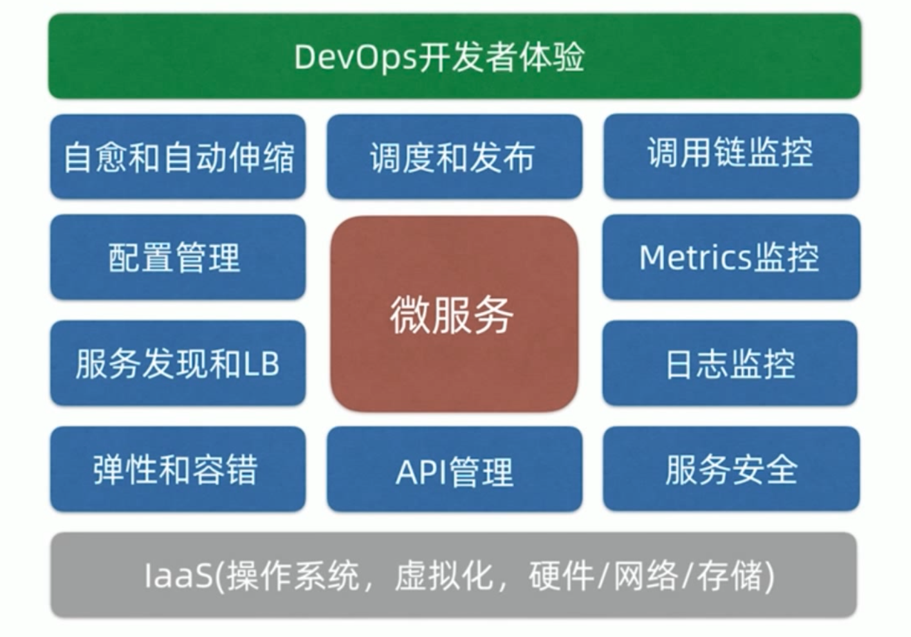

[TOC]

### 软件工程全生命周期工具：

质效提升

1. 项目管理

   1.  jira+confluence需求分析、任务分配、风险管控、bug追踪、文档管理、积累复盘
2. 开发

   1. API管理：yapi
   2. 自动化测试：
   3. 配置管理：nacos
   4. 服务发现：nacos
   5. 负载均衡、容错：nginx、gateway、ribbon、hystrix
   6. 安全与认证：oAuth2、keycloak、spring security
3. CI/CD

   1. 持续集成：git、maven、docker、jenkins
   2. 持续交付: docker-compose、docker swarm、k8s（rancher+helm）
   3. 制品库：jcr+
4. 运维

   1. [日志监控](日志分析)：elk、filebeat
   2. [链路追踪](链路追踪)：skywalking、zipkin
   3. [Metric监控](Metric监控)：spring-actuator、Prometheus+Alertmanager+Grafana
   4. 自愈、自动伸缩、调度与发布：k8s

##### refrence

1.https://www.kubernetes.org.cn/9711.html

2.



**我们需要devOps做什么？**

研发效能提升。让开发更专注于开发。减少测试部署时诸如环境配置、参数等不必要的问题及沟通。

**为什么要选择统一化的CI/CD?**

https://www.toutiao.com/article/6779098800825827852/

CI：1. 利用k12代码中的jenkins脚本(只有CI，需改造) 2. maven插件，自动化程度低，需打开本地docker，再执行任务

CD: 自写jenkins脚本

```text
1. docker-compose是每次都上传？若不是，怎么判断更改过了
1. docker-compose外界传入参数，如镜像库地址等，动态生成改变
```

**我们要做什么**？

符合开发场景的最佳实践。

### 变量配置

1. jar 启动所必须配置，本地bootstrap.yml,application.yml,远端nacos上配置,外部环境变量
2. 单个服务，如服务名端口等配置由每个模块Pom定义，后编译进yaml
3. mvn命令传递进pom的参数
4. jenkinsFile传递进mvn命令的参数
5. jenkinsFile传递进dockerFile的参数
6. dockerFile传递进java - jar的参数

#### 变量

1. 环境变量，mvn、jar、docker运行时都可读取，dockerCompose可提供，nacos中的yaml也可以用
2. 命令行传入的
3. 各个文件定义的

#### 文件

1. jenkinsFile
   1. CI
      1. 镜像 dockerFile
      2. jar    pom.xml  yaml
   2. CD
      1. [dockerCompose](https://segmentfault.com/a/1190000023655147)
      2. helm
2. https://www.jianshu.com/p/a471d859051a
3. https://blog.csdn.net/fuck487/article/details/75104765

#### 优先级

应该尽量放在最外部，只有不通用的才放在尽可能高的层

#### k12

1. cloud模块dockerCompose中的变量，从.env统一读取，供nacos中的yaml和bootstrap.yml使用
2. edge模块的dockerCompose，一种也是直接给springboot的yaml使用，一种是JAVA_OPTS，通过dockerFile传入ENV传入ENTRYPOINT，供java -jar使用

